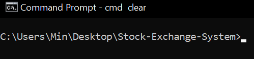

# Min's Simple Stock Exchange System
**Written by Min Kabar Kyaw**
## Running the program

<i> Requirements:
    Java JDK (https://www.oracle.com/java/technologies/downloads/#jdk17-windows) 
    Environment variable set up to use java in terminal (https://www.ibm.com/docs/en/b2b-integrator/5.2?topic=installation-setting-java-variables-in-windows)
    </i>
 
1. Open Command Prompt or your computer's Terminal console (<b>Win+R → cmd</b> in Windows)
2. Navigate to directory that contains the <b>stockexchangesystem.jar </b> 

3. Enter command "java -jar stockexchangesystem.jar"

**Alternatively,**

1. From the terminal, navigate to ../src folder inside the directory

2. Enter command "javac MainApp.java" to compile the MainApp
3. Enter command "java MainApp.java" to run the program
****
## Introduction

This program is built using Java to simulate a simple stock exchange system, where the user can request market or limit buy/sell orders via the console.

The system maintains three main <b>"databases": The history of all orders made, the current pending buy/sell orders, and the last traded price of a stock.</b>

The system is based on the assumption that **the highest priced buy order and the lowest priced sell order are given priority**. This means that when we make the market order, we are looking for the **best price available.** Likewise, when we make a limit order, we are looking for the best price available, but with **a limit to stop the trade from executing if the available price is beyond our limit.**
****
## System Overview

The **MainApp** application interacts with **MenuManager** to print various menus to display into the terminal. User input is received via the **LogicUnit** classes, which resolve what actions the system should perform based on the user's inputs.

When the user wants to create an order, the **TradeLogicUnit** runs and executes it's logic, where it asks the user various information about the order to create (Stock name, limit/market order type, buy/sell, quantity, etc.) Once an **Order** object is successfully created, it is then received by the **OrderManager** class via its **receiveOrder()** function.

Inside **receiveOrder()**, the OrderManager will attempt to find a matching order from its list of pending buy/sell orders. It will then execute the trade between the user's order and matching order via the **executeTrade()** function of the **Order** class.

Inside **executeTrade()**, it will be checked if the matching order is real or null; if it is null, or if the user's order can only be partially fulfilled, relevant values will be updated (quantity fulfilled, order status) and **the order will be added to OrderManager's corresponding pending buy/sell list**. If the user's order can be completely fulfilled, relevant values will be updated and **the order will not be added to the pending buy/sell lists.** At the end of the function, the **StockManager** will be updated with the latest traded price of the stock if there was a successful trade.
****
## Design Principles

The system is designed with **"SOLID"** object oriented design principles, ensuring that it is modular and maintainable.

### Single Responsiblity Principle
**A class should have only one reason to change.** 

Classes are divided into their own respective roles, and refrain from doing too many functions at once. For example, the **OrderManager** class that handles the trade system is completely isolated from a different part of the program that handles user interface, which is handled by **MenuManager**.

Another example is the **TradeLogicUnit** which handles user input for making trades, and **QuoteLogicUnit**, which handles user input for viewing stock quotes. They implement the same interface **LogicUnit** due to their similarity in handling user input logic, but as these logics are only required on separate menus, they are implemented as separate classes with their own responsibility. **This eliminates dependencies where logic breaking on one menu does not affect the other.**

### Open-Closed Principle
**Software Entities should be open for extension, but closed for modification.** 

The **OrderManager** receives orders and executes trades by calling **executeTrade()** from the **Order** abstract class, which must be implemented by its subclasses. How the trade is handled is different from subclass to subclass (in this case **BuyOrder** and **SellOrder**), but it does not matter to **OrderManager**; this way we can **extend more functionalities to the system by creating new subclasses that OrderManager can receive** (eg. classes for short selling, put options that implement their own executeTrade() function) **without modifying any existing code inside the OrderManager system.**

### Liskov Substitution Principle
**Any property defined of the superclass should also hold for the subclass.** 

As mentioned Open-Closed Principle, **OrderManager** receives the superclass **Order**, and calls its function **executeTrade()** without needing to know which actual subclass it is. (**BuyOrder** or **SellOrder**) This is only possible by adhering to Liskov Substitution Principle when creating the subclasses such that they adhere to the limitations of the superclass, i.e. do not demand extra parameters or additional results in **executeTrade().**

### Interface Segregation Principle
**Clients should not be forced to depend upon interfaces they do not use.** 

The system has different interfaces for different functions to ensure that clients are not burdened with implementing interfaces they do not need. For example, **TradeLogicUnit** and **QuoteLogicUnit** implement the **LogicUnit** interface to handle user input, and various classes responsible for printing like **PrintableQuote** and **PrintableOrderHisotry** implement the **Printable** interface.

### Dependency Inversion Principle
**High level modules should not depend on low level modules; both should depend on abstractions.** 

**MenuManager** is a high-level module called by MainApp to help print various menus. It interacts with the interface **Printable**, which acts as a layer of abstraction between the lower-level modules like **PrintableMainMenu**, **PrintableOrderHistory**, etc. **MenuManager** does not depend on the actual implementation of the low-level modules, it only expects it to call **print()** as specified by the **Printable** interface. This allows us to have easy extension of our program if we wish to create a brand new menu for a new feature: We can simply create a new class **PrintableNewFeature** that implements the **Printable** interface, and add a function in **MenuManager** that instantiates **PrintableNewFeature**. It also allows us to **eliminate dependencies between each of the lower-level modules;** if one of them is broken, the others are not affected.
****
## Test Cases

The system is able to handle simple scenarios as well as more complex interactions when orders of different types are interleaved. Some pointers for resolving trades and getting quotes: 

- When executing trades for a user order, **all matching orders in the pending list must be executed while the user order is not yet completely fulfilled.** Failure to do so will result in only the first matching order being completed.

- If there is a pending market order and limit order of the same type (buy/sell), **the market order is prioritised first**. This is due to how the pending lists are maintained, by sorting based on the order's prices. A market order has maximum/minimum value buy and sell prices respectively, which gives them the highest priority when sorting the pending list.

- Since a market order uses the maximum/minimum value buy/sell prices, when finding a quote for a stock, if there are **only pending market buy/sell orders**, we **should not display the ask and bid prices** as they should not be available.

### Limit - Limit scenario
This is the simplest scenario, where we only have limit buy and limit sell orders.

**Exact price match:** 
  

**Best price match:** 
  
Note that the order with the lowest sell price is prioritised over the one with a higher sell price.
 
 
 
**Partial fulfillment + Serve all matching orders:** 
  
Note that the best price sell order is prioritised; after it has been filled, our limit buy order still has **quantity 5 leftover**, which matches with the remaining order selling at $100. Thus we can completely fulfill our buy order, and partially fulfill the second sell order.

### Limit - Market scenario
We can have a mix of limit and market orders.

**Priority fulfillment:** 
  
Note that the market buy order is prioritised over the limit buy, even though both are eligible. It should also be emphasised that **this is a special case where a market order is placed while there is no pending sell orders.** This means that whatever sell price someone places next, even if it is a very large amount, will be fulfilled through that market buy order.

### Viewing Quote of a stock
There are **eight possible outcomes** for the combination of Bid, Ask and Last when we attempt to get a stock's quote. (For the mathematically inclined, each of the three values can either be present or absent (2 choices), so the total combinations of the values either present or absent is 23 = 8.) 

**1. No information exists:** 
  
When we attempt to find information about a stock with no ask, bid and last information (i.e. it has never been traded on the system before), we return an error message.
 
 
 

**2. Ask, Bid and Last exists:** 
  
There are pending buy and sell orders, and there has also been at least one trade that has happened for the stock we are enquiring.

**3. Ask and Bid exists:** 
  
There are pending buy and sell orders, but no trade has ever happened yet for the stock.

**4. Bid and Last exists:** 
  
A trade has occurred before, and currently there are only pending buy orders.
 
 
**5. Ask and Last exists:** 
  
A trade has occurred before, and currently there are only pending sell orders.

**6. Only Bid exists:** 
  
There are pending buy orders, but no trade has ever happened yet for the stock.

**7. Only Ask exists:** 
  
There are pending sell orders, but no trade has ever happened yet for the stock.
 
 
 
**8. Only Last exists:** 
  
There are no pending buy/sell orders, and a trade has happened before for the stock.
****
## Insights
 

For simplicity, **Double-Precision Floating Point Format (double)** datatype standardized in [IEEE 754](https://en.wikipedia.org/wiki/IEEE_754) was chosen to store the monetary value as well as the quantity of the stocks in this system. However, it should be noted that floating point values accumulate small errors when performing arithmetic calculations, stemming from the fact that it is unable to give an exact representation for some numbers; **This can result in the values stored having small errors.** For practical purposes, it may be better to use alternative datatypes/representations such as **BigDecimal** provided in Java.

Market orders are always prioritised in this system. This is because their value is considered as a **maximum bid** or a **minimum ask.**  However, if we have a scenario where a market order and limit order are both waiting for a matching order, and an incoming order can satisfy either one of them, it might be fairer to give the trade to the order that came in first, instead of automatically giving the market order priority.

In our system, we have an implicit assumption based on the problem statement that the stock database and order information can be retrieved via simple function calls. In a real and more pratical application (Like a broker app), information such as stock quotes will probably have to be retrieved via API calls to remote servers, and may require an entirely different kind of system design altogether; in fact, we may not even be settling the trading logic for things like market and limit orders, but simply facilitate the process such that it is easier for the user to access the information and make informed decisions.
****
